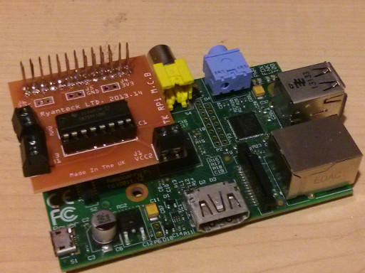
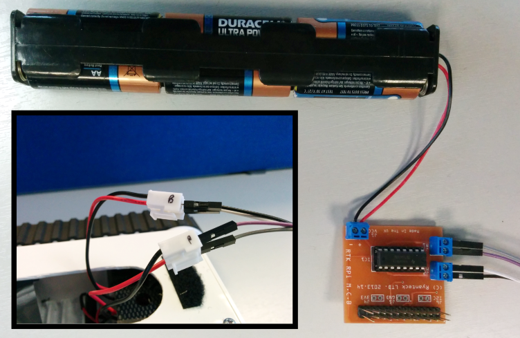
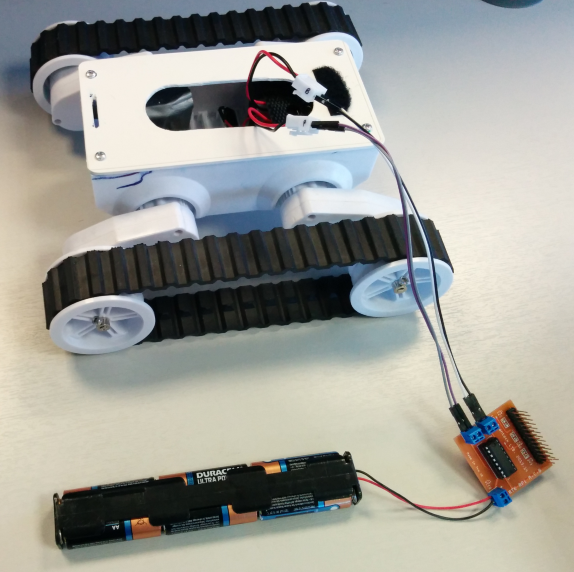
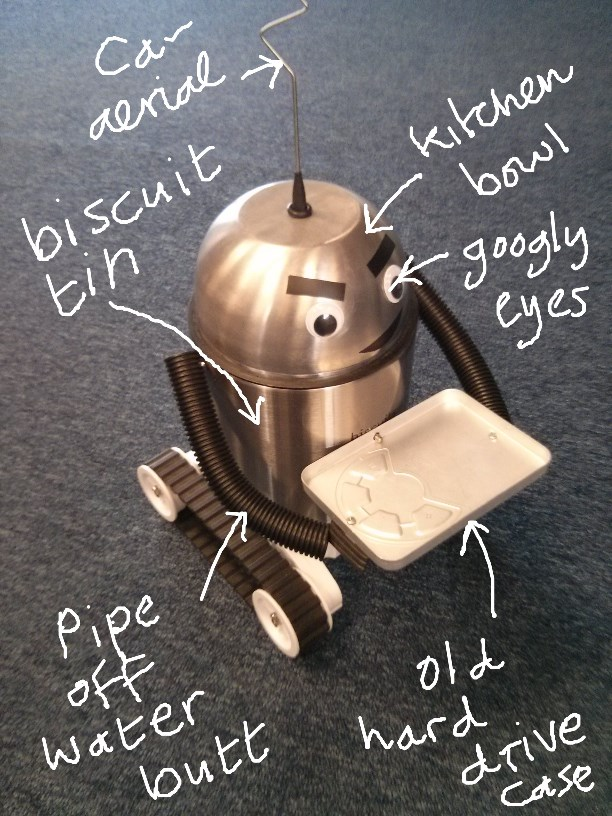

# Getting started

It's always good to break down projects into chunks, as it makes it much easier to troubleshoot. If you do this project all at once and it doesn't work, how do you know if it's the motor board, the motors, the Bluetooth connection or your program at fault? The steps are:

1. Set up and test the motor board and motors
2. Set up and test the Bluetooth connection
3. Set up and test the Wiimote
3. Write the final program
4. Serve a nice cup of tea to your mum.
 
## Step 1. Connect the motor board to the Pi

Put the board on the Raspberry Pi GPIO pins. It should look like this:



## Step 2. Connect the motor to the motor board

Connect one motor to the blue connector marked J3/M1, using wires stripped at each end or male-male header cables. Connect the other motor to J2/M2. It does not matter which way round you connect each individual motor at this point (if a motor turns the wrong way then just swap the wires around) but you should have something like this:

 

Tape the connections between the motor wires and the headers, to stop them coming loose.

Finally, connect the battery pack to the motor board as shown above. Here's what you should have at this point:

 

You now have a battery pack connected to the robot's motors via the motor control board. We will use the Raspberry Pi to control how and when the motors receive power. 

## Step 3. Test the motors

The Ryanteck board is controlled using pins 17, 18, 22 and 23 of Raspberry Pi [GPIO] . If you set pin 17 high, motor one goes clockwise, whereas pin 18 high turns it anticlockwise. Pins 22 and 23 control motor 2.

Let's write a small Python script to test that everything's working. 

At the command line type `nano test_motors.py`. Type in the following [program](test.py):

```python
import RPi.GPIO as io
import time

io.setmode(io.BCM)
pins = [17, 18, 22, 23]
for pin in pins:
  io.setup(pin, io.output)

#test motors by spinning each one way then the other with 0.5 sec delay
for pin in pins:
  print ('Testing pin ' + str(pin))
  io.output(pin, 1)
  time.sleep(0.5)
  io.output(pin, 0)

``` 

Press `CTRL-o` and then `Enter` to save
Press `CTRL-x` to exit to the command line

Now run the test program: `sudo python test_motors.py`.

If the test does not run as expected, check all connections and batteries and try again.

## Step 4. Set up the Bluetooth dongle

1. Plug the Bluetooth dongle into the Raspberry Pi's USB, boot it up and log in.
2. Follow the instructions in the [Bluetooth set up] guide.

## Step 5. Test that your Wiimote can connect to the Raspberry Pi

Follow the instructions in the [Wiimote set up] guide.

## Step 6. Type in the main program

This is the main program that will let you control the rover with the Wiimote. At the command line type `nano robot.py`. Type, or cut and paste, this [program](robot.py). When you have finished:

Press `CTRL-o` and then `Enter` to save
Press `CTRL-x` to exit to the command line

Now run the program: `sudo python robot.py`.

If everything is working properly you should be able to control your rover with the Wiimote. If not, go back through the guide and check that each step is working properly.

## Step 7. Make your robot's body

Now you have a remote-controlled rover, which is completely fantastic, but he looks a little ... rovery. He clearly needs sprucing up and androidifying. How you do this is up to you, but use your imagination to make a robot worthy of having a Raspberry Pi stuck up its bum. Tip: recycling, reusing and repurposing is good! Here's how we made ours:



## Step 8. Improvements

In the next worksheet we will show you how to automatically run the Python script on startup, and give you spoken cues so that you know when to connect the Wiimote. You will also learn how to make your robot speak!

[GPIO]: http://www.raspberrypi.org/documentation/usage/gpio/README.md
[Bluetooth set up]: bluetooth-setup.md
[Wiimote set up]: wiimote-setup.md
